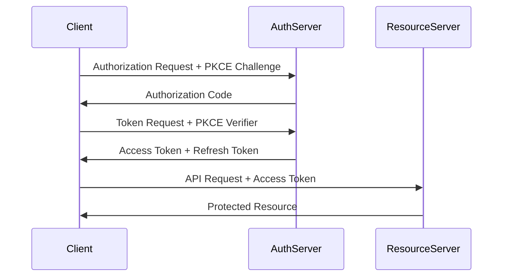

# Security Documentation

This document provides comprehensive security information for the ImaniPay Blockchain Service, including security architecture, compliance requirements, and best practices.

## Table of Contents

- [Security Overview](#security-overview)
- [Security Architecture](#security-architecture)
- [Authentication & Authorization](#authentication--authorization)
- [Data Protection](#data-protection)
- [Network Security](#network-security)
- [Blockchain Security](#blockchain-security)
- [Compliance & Regulations](#compliance--regulations)
- [Security Monitoring](#security-monitoring)
- [Incident Response](#incident-response)
- [Security Best Practices](#security-best-practices)

## Security Overview

ImaniPay Blockchain Service implements a comprehensive security framework designed to protect user data, financial transactions, and blockchain assets. Our security approach follows industry best practices and regulatory requirements for financial services.

### Security Principles

1. **Defense in Depth**: Multiple layers of security controls
2. **Zero Trust Architecture**: Never trust, always verify
3. **Principle of Least Privilege**: Minimal access rights
4. **Data Minimization**: Collect and store only necessary data
5. **Transparency**: Clear security policies and procedures
6. **Continuous Monitoring**: Real-time threat detection and response

### Threat Model

Our security design addresses the following threat categories:

- **External Attackers**: Unauthorized access attempts, DDoS attacks
- **Insider Threats**: Malicious or negligent internal actors
- **Data Breaches**: Unauthorized access to sensitive information
- **Financial Fraud**: Payment manipulation and money laundering
- **Blockchain Attacks**: Smart contract vulnerabilities, private key theft
- **Regulatory Violations**: Non-compliance with financial regulations

## Security Architecture

### Multi-Layer Security Model

```
┌─────────────────────────────────────────────────────────────┐
│                    User Interface Layer                     │
├─────────────────────────────────────────────────────────────┤
│                  API Gateway & Load Balancer               │
│  • Rate Limiting  • DDoS Protection  • SSL Termination    │
├─────────────────────────────────────────────────────────────┤
│                   Application Layer                        │
│  • Authentication  • Authorization  • Input Validation    │
├─────────────────────────────────────────────────────────────┤
│                    Service Layer                           │
│  • Business Logic  • Encryption  • Audit Logging         │
├─────────────────────────────────────────────────────────────┤
│                     Data Layer                             │
│  • Database Encryption  • Access Controls  • Backups     │
├─────────────────────────────────────────────────────────────┤
│                 Infrastructure Layer                       │
│  • Network Security  • Host Security  • Monitoring       │
└─────────────────────────────────────────────────────────────┘
```

### Security Components

#### 1. API Gateway Security
- **Rate Limiting**: Prevents abuse and DDoS attacks
- **Request Validation**: Input sanitization and validation
- **SSL/TLS Termination**: Encrypted communication
- **IP Whitelisting**: Restrict access by IP address
- **Geographic Blocking**: Block requests from restricted regions

#### 2. Application Security
- **OAuth2 + JWT**: Industry-standard authentication
- **Multi-Factor Authentication**: TOTP-based 2FA
- **Role-Based Access Control**: Granular permissions
- **Session Management**: Secure session handling
- **CSRF Protection**: Cross-site request forgery prevention

#### 3. Data Security
- **Encryption at Rest**: AES-256-GCM encryption
- **Encryption in Transit**: TLS 1.3 for all communications
- **Key Management**: Secure key derivation and rotation
- **Data Masking**: Sensitive data obfuscation
- **Secure Deletion**: Cryptographic erasure

#### 4. Infrastructure Security
- **Network Segmentation**: Isolated network zones
- **Firewall Rules**: Restrictive network access
- **Intrusion Detection**: Real-time threat monitoring
- **Vulnerability Scanning**: Regular security assessments
- **Container Security**: Secure container configurations

## Authentication & Authorization

### OAuth2 Implementation

ImaniPay uses OAuth2 with PKCE (Proof Key for Code Exchange) for secure authentication:



### JWT Token Security

**Access Tokens:**
- Short-lived (15-30 minutes)
- Contains user claims and permissions
- Signed with HMAC-SHA256
- Includes expiration and issuer validation

**Refresh Tokens:**
- Long-lived (7 days)
- Stored securely in database
- Single-use with rotation
- Revocable for security incidents

### Multi-Factor Authentication (MFA)

**TOTP Implementation:**
- Time-based One-Time Passwords
- 30-second time windows
- 6-digit codes
- QR code setup for authenticator apps
- Backup codes for account recovery

**MFA Enforcement:**
- Required for high-value transactions (>$1,000)
- Required for administrative operations
- Required for API key generation
- Optional for regular transactions

### Role-Based Access Control (RBAC)

**User Roles:**
- **Customer**: Basic payment operations
- **Business**: Enhanced transaction limits
- **Partner**: API access for integrations
- **Admin**: System administration
- **Auditor**: Read-only access for compliance

**Permission Scopes:**
- `user:read` - Read user profile
- `user:write` - Update user profile
- `wallet:read` - View wallet information
- `wallet:write` - Create and manage wallets
- `payment:read` - View payment history
- `payment:write` - Initiate payments
- `admin:read` - Administrative read access
- `admin:write` - Administrative write access

## Data Protection

### Encryption Standards

#### Encryption at Rest
- **Algorithm**: AES-256-GCM
- **Key Derivation**: PBKDF2 with 100,000 iterations
- **Salt**: Unique 32-byte salt per record
- **Key Rotation**: Automatic monthly rotation
- **Backup Encryption**: Separate encryption for backups

#### Encryption in Transit
- **Protocol**: TLS 1.3
- **Cipher Suites**: ECDHE-RSA-AES256-GCM-SHA384
- **Certificate**: EV SSL certificates
- **HSTS**: HTTP Strict Transport Security enabled
- **Certificate Pinning**: Mobile app certificate pinning

### Sensitive Data Handling

#### Personal Identifiable Information (PII)
- **Email Addresses**: Hashed for indexing, encrypted for storage
- **Phone Numbers**: Encrypted with format-preserving encryption
- **Names**: Encrypted with searchable encryption
- **Addresses**: Encrypted and tokenized
- **Government IDs**: Encrypted with additional access controls

#### Financial Data
- **Account Numbers**: Tokenized with external vault
- **Transaction Amounts**: Encrypted with audit trails
- **Payment Methods**: PCI DSS compliant tokenization
- **Balances**: Real-time encryption with integrity checks

#### Blockchain Data
- **Private Keys**: Hardware Security Module (HSM) storage
- **Mnemonics**: Encrypted with user-specific keys
- **Wallet Addresses**: Public but associated with encrypted metadata
- **Transaction History**: Encrypted metadata, public blockchain data

### Data Classification

| Classification | Description | Examples | Protection Level |
|----------------|-------------|----------|------------------|
| Public | Publicly available information | API documentation, marketing materials | Standard |
| Internal | Internal business information | System logs, metrics | Access controls |
| Confidential | Sensitive business information | User data, transaction records | Encryption + access controls |
| Restricted | Highly sensitive information | Private keys, compliance data | HSM + strict access controls |

### Data Retention and Disposal

**Retention Policies:**
- **Transaction Records**: 7 years (regulatory requirement)
- **User Profiles**: Until account closure + 1 year
- **Audit Logs**: 3 years
- **System Logs**: 90 days
- **Backup Data**: 1 year

**Secure Disposal:**
- **Cryptographic Erasure**: Delete encryption keys
- **Physical Destruction**: Secure media destruction
- **Verification**: Confirm data is unrecoverable
- **Documentation**: Maintain disposal records

## Network Security

### Network Architecture

```
Internet
    │
    ▼
┌─────────────────┐
│   WAF/CDN       │  ← DDoS Protection, Rate Limiting
└─────────────────┘
    │
    ▼
┌─────────────────┐
│ Load Balancer   │  ← SSL Termination, Health Checks
└─────────────────┘
    │
    ▼
┌─────────────────┐
│ API Gateway     │  ← Authentication, Authorization
└─────────────────┘
    │
    ▼
┌─────────────────┐
│ Application     │  ← Business Logic, Validation
│ Servers         │
└─────────────────┘
    │
    ▼
┌─────────────────┐
│ Database        │  ← Encrypted Storage
│ Cluster         │
└─────────────────┘
```

### Firewall Configuration

**External Firewall Rules:**
```bash
# Allow HTTPS traffic
iptables -A INPUT -p tcp --dport 443 -j ACCEPT

# Allow HTTP traffic (redirect to HTTPS)
iptables -A INPUT -p tcp --dport 80 -j ACCEPT

# Allow SSH from management network only
iptables -A INPUT -p tcp --dport 22 -s 10.0.0.0/8 -j ACCEPT

# Block all other traffic
iptables -A INPUT -j DROP
```

**Internal Network Segmentation:**
- **DMZ**: Web servers and load balancers
- **Application Zone**: API servers and services
- **Database Zone**: Database servers and storage
- **Management Zone**: Administrative and monitoring systems

### DDoS Protection

**Protection Layers:**
1. **CDN Level**: Cloudflare/AWS CloudFront
2. **Network Level**: Rate limiting and traffic shaping
3. **Application Level**: Request validation and throttling
4. **Database Level**: Connection pooling and query optimization

**Mitigation Strategies:**
- **Rate Limiting**: 100 requests/minute per IP
- **Geographic Filtering**: Block traffic from high-risk countries
- **Behavioral Analysis**: Detect and block suspicious patterns
- **Failover**: Automatic traffic rerouting during attacks

## Blockchain Security

### Private Key Management

**Key Generation:**
- **Entropy Source**: Hardware random number generator
- **Algorithm**: secp256k1 elliptic curve
- **Validation**: Key validation before use
- **Backup**: Encrypted backup to multiple locations

**Key Storage:**
- **Production**: Hardware Security Module (HSM)
- **Development**: Encrypted key files
- **User Keys**: Client-side generation and storage
- **Recovery**: Secure key recovery mechanisms

**Key Rotation:**
- **Scheduled Rotation**: Annual key rotation
- **Emergency Rotation**: Immediate rotation on compromise
- **Migration**: Secure key migration procedures
- **Audit**: Complete audit trail of key operations

### Smart Contract Security

**Development Security:**
- **Code Review**: Mandatory peer review process
- **Static Analysis**: Automated vulnerability scanning
- **Testing**: Comprehensive unit and integration tests
- **Formal Verification**: Mathematical proof of correctness

**Deployment Security:**
- **Testnet Deployment**: Thorough testing on testnet
- **Gradual Rollout**: Phased deployment with monitoring
- **Upgrade Mechanisms**: Secure contract upgrade procedures
- **Emergency Stops**: Circuit breakers for critical issues

**Runtime Security:**
- **Access Controls**: Multi-signature requirements
- **Rate Limiting**: Transaction frequency limits
- **Monitoring**: Real-time transaction monitoring
- **Incident Response**: Automated response to anomalies

### Transaction Security

**Transaction Validation:**
- **Digital Signatures**: Cryptographic signature verification
- **Balance Checks**: Sufficient balance validation
- **Duplicate Prevention**: Nonce-based replay protection
- **Timeout Handling**: Transaction expiration mechanisms

**Transaction Monitoring:**
- **Real-time Analysis**: Immediate transaction analysis
- **Pattern Detection**: Suspicious activity identification
- **Risk Scoring**: Transaction risk assessment
- **Automated Blocking**: High-risk transaction prevention

## Compliance & Regulations

### Regulatory Framework

ImaniPay complies with multiple regulatory frameworks:

#### Financial Regulations
- **PCI DSS**: Payment Card Industry Data Security Standard
- **AML/CFT**: Anti-Money Laundering and Counter-Terrorism Financing
- **KYC**: Know Your Customer requirements
- **GDPR**: General Data Protection Regulation
- **SOX**: Sarbanes-Oxley Act (if applicable)

#### Regional Compliance
- **Nigeria**: CBN Guidelines on Electronic Payment
- **Kenya**: CBK National Payment System Regulations
- **Ghana**: BoG Payment Systems and Services Act
- **South Africa**: SARB National Payment System Framework

### KYC/AML Implementation

**Customer Due Diligence (CDD):**
- **Identity Verification**: Government-issued ID validation
- **Address Verification**: Utility bill or bank statement
- **Biometric Verification**: Facial recognition and liveness detection
- **Document Authentication**: AI-powered document verification

**Enhanced Due Diligence (EDD):**
- **High-Risk Customers**: Additional verification requirements
- **PEP Screening**: Politically Exposed Person identification
- **Sanctions Screening**: OFAC and UN sanctions list checking
- **Source of Funds**: Wealth and income verification

**Ongoing Monitoring:**
- **Transaction Monitoring**: Real-time suspicious activity detection
- **Periodic Reviews**: Regular customer profile updates
- **Risk Reassessment**: Dynamic risk scoring updates
- **Regulatory Reporting**: Automated compliance reporting

### Data Protection Compliance

**GDPR Compliance:**
- **Lawful Basis**: Clear legal basis for data processing
- **Consent Management**: Granular consent mechanisms
- **Data Portability**: User data export capabilities
- **Right to Erasure**: Secure data deletion procedures
- **Privacy by Design**: Built-in privacy protections

**Data Processing Records:**
- **Processing Activities**: Detailed processing documentation
- **Data Flows**: Complete data flow mapping
- **Retention Schedules**: Clear data retention policies
- **Third-Party Processors**: Vendor compliance verification

### Audit and Reporting

**Internal Audits:**
- **Quarterly Reviews**: Regular security assessments
- **Penetration Testing**: Annual third-party testing
- **Compliance Audits**: Regulatory compliance verification
- **Risk Assessments**: Ongoing risk evaluation

**External Audits:**
- **SOC 2 Type II**: Annual service organization audit
- **PCI DSS**: Annual payment security audit
- **ISO 27001**: Information security management audit
- **Regulatory Examinations**: Government agency reviews

**Reporting Requirements:**
- **Suspicious Activity Reports (SARs)**: AML compliance reporting
- **Data Breach Notifications**: GDPR breach reporting
- **Regulatory Filings**: Required compliance submissions
- **Board Reporting**: Executive security briefings

## Security Monitoring

### Security Operations Center (SOC)

**24/7 Monitoring:**
- **Security Events**: Real-time event correlation
- **Threat Intelligence**: External threat feed integration
- **Incident Detection**: Automated anomaly detection
- **Response Coordination**: Incident response orchestration

**Monitoring Tools:**
- **SIEM**: Security Information and Event Management
- **IDS/IPS**: Intrusion Detection and Prevention Systems
- **Vulnerability Scanners**: Automated security assessments
- **Threat Hunting**: Proactive threat identification

### Key Security Metrics

**Authentication Metrics:**
- Failed login attempts per hour
- MFA bypass attempts
- Account lockout frequency
- Password reset requests

**Transaction Metrics:**
- High-value transaction frequency
- Cross-border transaction patterns
- Failed transaction attempts
- Suspicious activity alerts

**System Metrics:**
- API response times
- Database connection failures
- Network traffic anomalies
- Resource utilization patterns

### Alerting and Escalation

**Alert Severity Levels:**
- **Critical**: Immediate response required (< 15 minutes)
- **High**: Response within 1 hour
- **Medium**: Response within 4 hours
- **Low**: Response within 24 hours

**Escalation Procedures:**
1. **Level 1**: SOC Analyst initial response
2. **Level 2**: Senior Security Engineer escalation
3. **Level 3**: Security Manager involvement
4. **Level 4**: CISO and executive notification

## Incident Response

### Incident Response Plan

**Phase 1: Preparation**
- Incident response team formation
- Communication procedures establishment
- Tool and resource preparation
- Training and awareness programs

**Phase 2: Detection and Analysis**
- Incident identification and classification
- Evidence collection and preservation
- Impact assessment and prioritization
- Initial containment measures

**Phase 3: Containment, Eradication, and Recovery**
- Threat containment and isolation
- Root cause analysis and remediation
- System restoration and validation
- Service resumption procedures

**Phase 4: Post-Incident Activity**
- Incident documentation and reporting
- Lessons learned analysis
- Process improvement implementation
- Stakeholder communication

### Incident Classification

**Security Incidents:**
- **Data Breach**: Unauthorized access to sensitive data
- **System Compromise**: Malware infection or unauthorized access
- **DDoS Attack**: Denial of service attacks
- **Insider Threat**: Malicious or negligent insider activity

**Operational Incidents:**
- **Service Outage**: System unavailability
- **Performance Degradation**: Slow response times
- **Data Corruption**: Data integrity issues
- **Configuration Errors**: Misconfiguration problems

### Communication Procedures

**Internal Communication:**
- **Incident Team**: Immediate notification via secure channels
- **Management**: Executive briefings within 2 hours
- **Legal Team**: Regulatory notification assessment
- **Public Relations**: External communication coordination

**External Communication:**
- **Customers**: Transparent incident updates
- **Regulators**: Mandatory breach notifications
- **Partners**: Vendor and partner notifications
- **Media**: Coordinated public statements

## Security Best Practices

### Development Security

**Secure Coding Practices:**
- **Input Validation**: Validate all user inputs
- **Output Encoding**: Encode outputs to prevent XSS
- **SQL Injection Prevention**: Use parameterized queries
- **Authentication**: Implement strong authentication
- **Authorization**: Enforce proper access controls

**Code Review Process:**
- **Peer Review**: Mandatory code review by peers
- **Security Review**: Security-focused code review
- **Automated Scanning**: Static analysis tool integration
- **Vulnerability Testing**: Dynamic security testing

### Operational Security

**System Hardening:**
- **Minimal Installation**: Install only necessary components
- **Regular Updates**: Apply security patches promptly
- **Service Configuration**: Secure service configurations
- **Account Management**: Disable unnecessary accounts
- **Logging**: Enable comprehensive logging

**Access Management:**
- **Principle of Least Privilege**: Minimal access rights
- **Regular Reviews**: Periodic access reviews
- **Segregation of Duties**: Separate critical functions
- **Multi-Person Authorization**: Require multiple approvals

### User Security

**Password Policy:**
- **Complexity**: Minimum 12 characters with mixed case
- **Uniqueness**: No password reuse for 12 generations
- **Expiration**: Annual password changes
- **Breach Response**: Immediate password reset on breach

**Security Awareness:**
- **Training Programs**: Regular security training
- **Phishing Simulations**: Simulated phishing attacks
- **Security Updates**: Regular security communications
- **Incident Reporting**: Clear reporting procedures

## Security Contact Information

**Security Team:**
- **Email**: security@imanipay.com
- **Phone**: +1-555-SECURITY (24/7)
- **PGP Key**: Available at https://imanipay.com/security/pgp

**Vulnerability Reporting:**
- **Bug Bounty**: https://imanipay.com/security/bounty
- **Responsible Disclosure**: security-disclosure@imanipay.com
- **Encrypted Reporting**: Use PGP key for sensitive reports

**Emergency Contacts:**
- **CISO**: ciso@imanipay.com
- **Legal**: legal@imanipay.com
- **Compliance**: compliance@imanipay.com
- **Executive**: executive@imanipay.com

---

*This security documentation is reviewed and updated quarterly. Last updated: January 2024*

